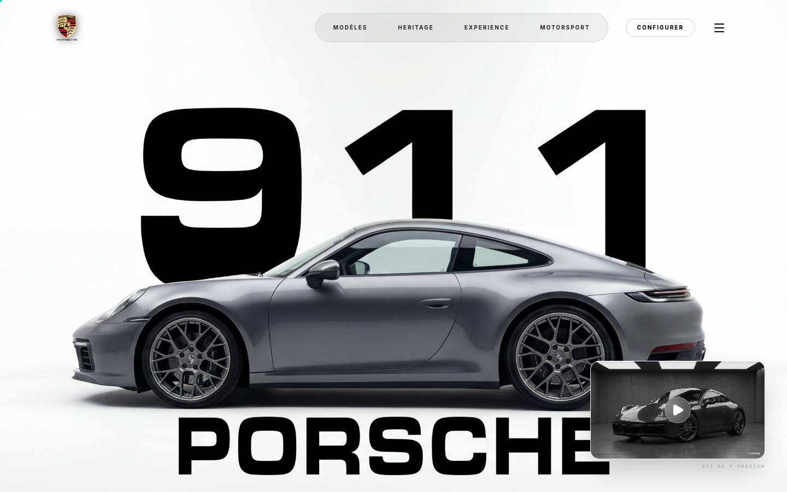

# porshe

Site vitrine de demonstration autour de l'univers Porsche, realise comme support de presentation pour mes clients.

## Apercu



## Objectif

Ce projet presente une direction artistique automobile, une ambiance premium et un exemple de site editorial inspire de l'univers Porsche.

## Positionnement

- projet de demonstration frontend
- site de fan non officiel
- support de presentation pour montrer mon travail a des clients

## Stack

- React
- TypeScript
- Vite

## Lancement en local

```bash
npm install
npm run dev
```

## Note

Ce projet est un site de fan et de presentation. Il n'a aucun lien officiel avec Porsche.
